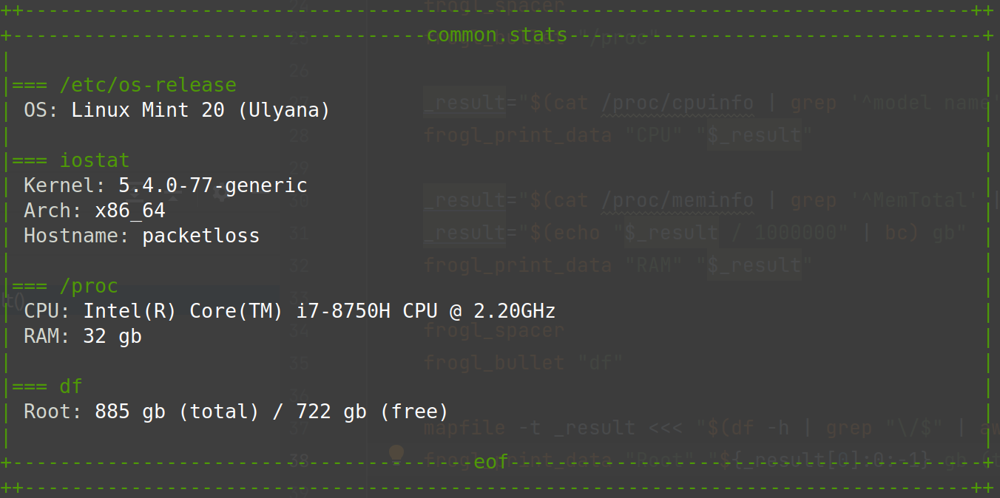

# bullfrog

# usage
`bullfrog [-options] <name.space> <operation> [--parameters]`

## options
Options adhere to standard getopts conventions.

`-a {app}` (*bullfrog*) Specifies a standalone bullfrog [-a]pp with its own config and imports.  
`-c {config}` (*default*) Specifies the [-c]onfiguration profile name to load on startup.  
`-f` (*disabled*) [-F]orces any commands that accept that option and automatically fills in prompts where possible.  
`-r {remote host}` (*localhost*) Runs the bullfrog command [-r]emotely via SSH on the host machine.  
`-x` (*disabled*) Enables internal debugging.  
`-X` (*disabled*) Enables bash debugging via *set -x*.

## parameters
Parameters follow the format:  
`--my.param.name "value"`
  
## naming rules
Namespaces, operations, and parameter names all adhere to the same validation rules.
  
Names consist of one or more lowercase *a-z* and *0-9* characters and may be separated by a single **.** (dot) character.
 
# module structure
Each bullfrog package provides a namespace configuration that links multiple fully qualified namespaces to their respective module bash scripts.
  
The module script requested by namespace is sourced by bullfrog on startup. The operation specified is linked to a function in said module, which is then called.
  
Any parameters provided are pre-validated based on packae configuration and passed to the operation function.
